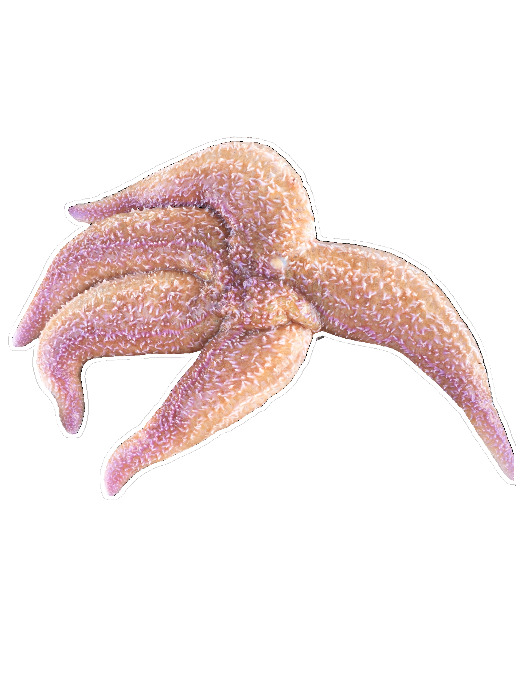
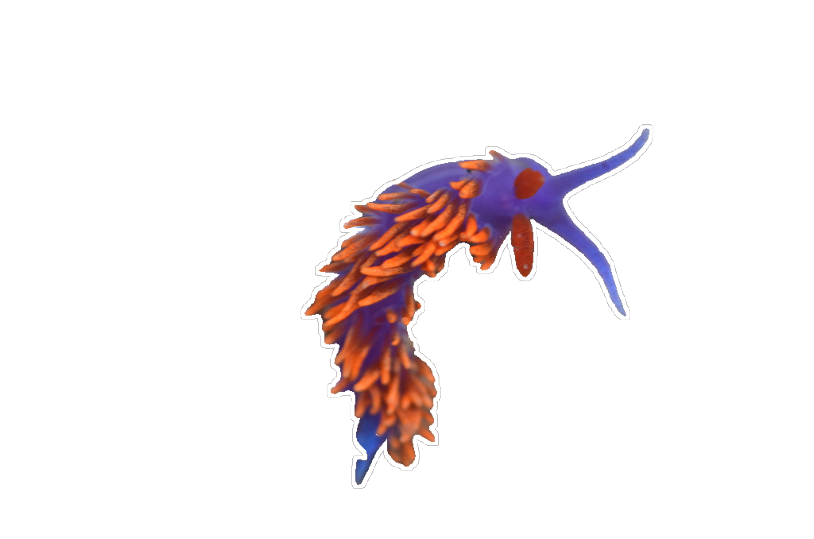
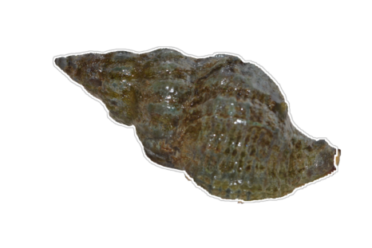
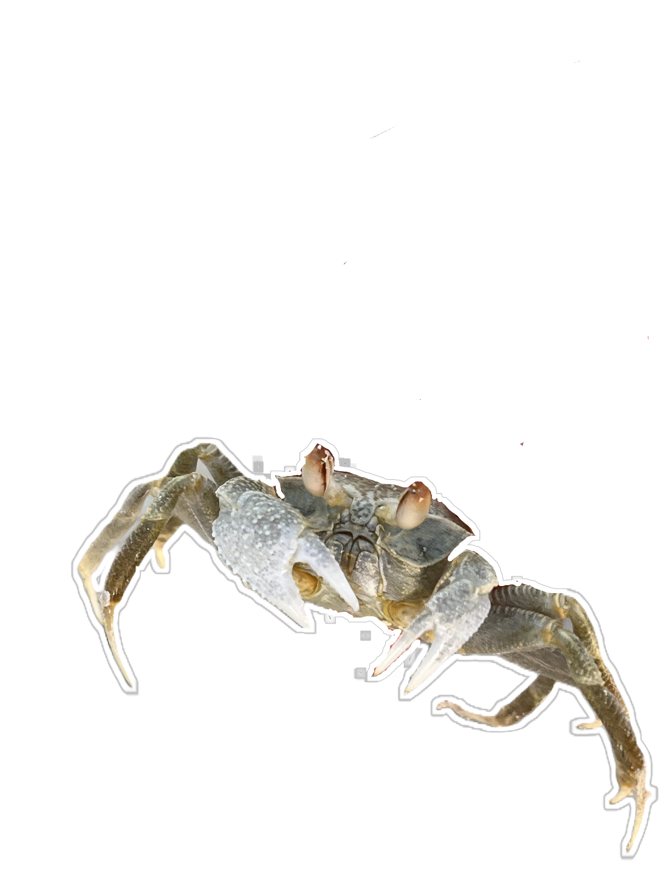
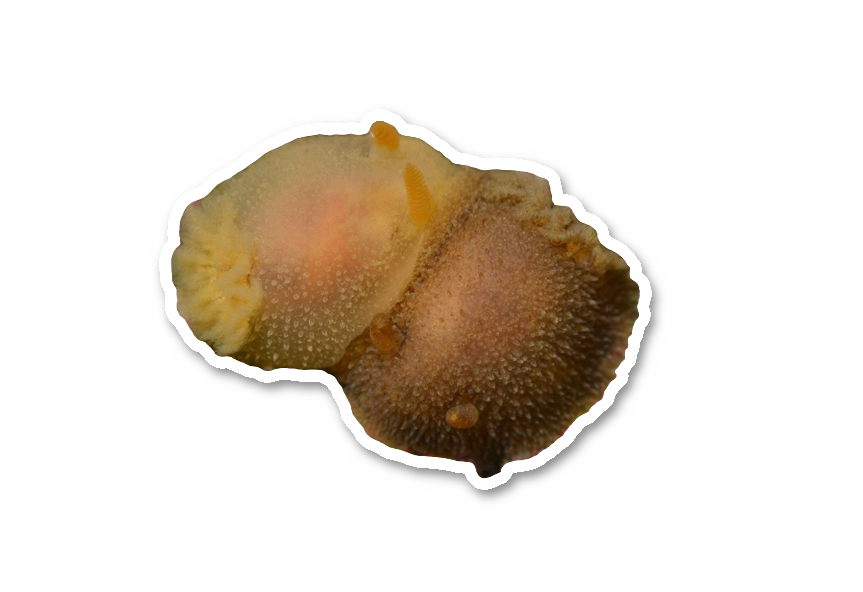

```{=html}
<body class="homepage nav-relative fullcontent quarto-light" data-bs-offset="60">
<div class="glassmorphism">
  <div class="intro">
    I am a marine ecologist working at the nexus of thermal ecology, extreme events, and forecasting
  </div>
</div>

<div class="silhouette-links">
  <!-- Image 1 -->
  <div class="silhouette-wrapper" style="top: 70px; left: 6%; position: absolute;">
    <svg class="ring-label" viewBox="0 0 180 180" aria-hidden="true">
      <defs><path id="arc1" d="M 14,90 A 76,76 0 0 1 166,90"/></defs>
      <text><textPath href="#arc1" startOffset="50%" text-anchor="middle">About</textPath></text>
    </svg>
    <a href="about.html" title="About">
      
    </a>
  </div>

  <!-- Image 2 -->
  <div class="silhouette-wrapper" style="top: 210px; left: 24%; position: absolute;">
    <svg class="ring-label" viewBox="0 0 180 180" aria-hidden="true">
      <defs><path id="arc2" d="M 14,90 A 76,76 0 0 1 166,90"/></defs>
      <text><textPath href="#arc2" startOffset="50%" text-anchor="middle">Research</textPath></text>
    </svg>
    <a href="research.html" title="Research">
      
    </a>
  </div>

  <!-- Image 3 -->
  <div class="silhouette-wrapper" style="top: 80px; left: 45%; position: absolute;">
    <svg class="ring-label" viewBox="0 0 180 180" aria-hidden="true">
      <defs><path id="arc3" d="M 14,90 A 76,76 0 0 1 166,90"/></defs>
      <text><textPath href="#arc3" startOffset="50%" text-anchor="middle">Publications</textPath></text>
    </svg>
    <a href="publications.html" title="Publications">
      
    </a>
  </div>

  <!-- Image 4 -->
  <div class="silhouette-wrapper" style="top: 220px; left: 64%; position: absolute;">
    <svg class="ring-label" viewBox="0 0 180 180" aria-hidden="true">
      <defs><path id="arc4" d="M 14,90 A 76,76 0 0 1 166,90"/></defs>
      <text><textPath href="#arc4" startOffset="50%" text-anchor="middle">Blog</textPath></text>
    </svg>
    <a href="posts.html" title="Blog">
      
    </a>
  </div>

  <!-- Image 5 -->
  <div class="silhouette-wrapper" style="top: 90px; left: 82%; position: absolute;">
    <svg class="ring-label" viewBox="0 0 180 180" aria-hidden="true">
      <defs><path id="arc5" d="M 14,90 A 76,76 0 0 1 166,90"/></defs>
      <text><textPath href="#arc5" startOffset="50%" text-anchor="middle">Products</textPath></text>
    </svg>
    <a href="products.html" title="Products and Ephemera">
      
    </a>
  </div>

</div>
```
