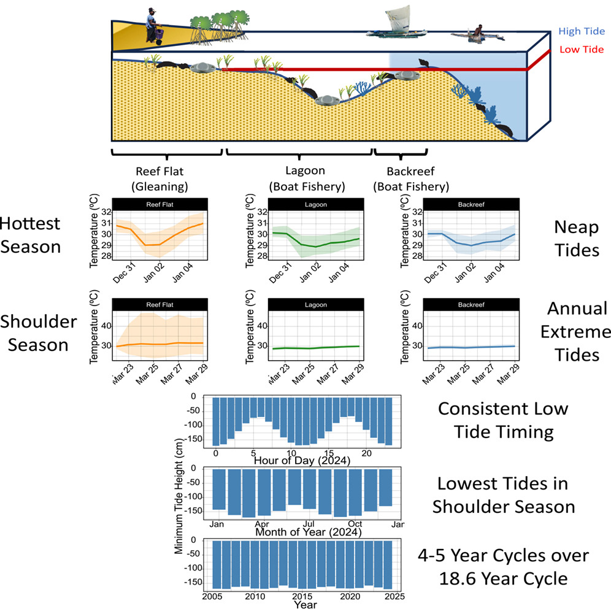
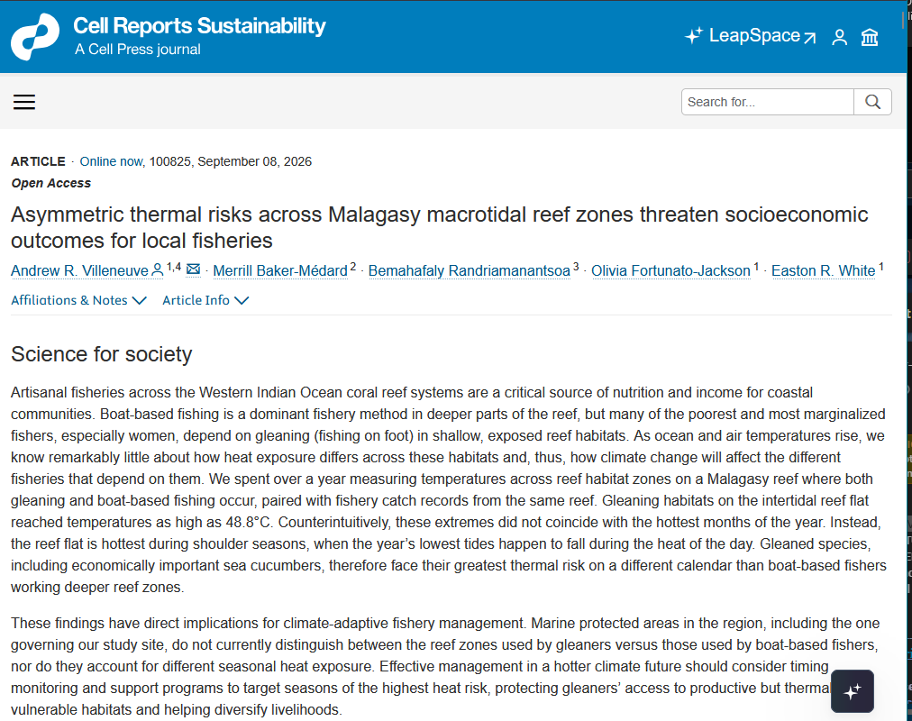
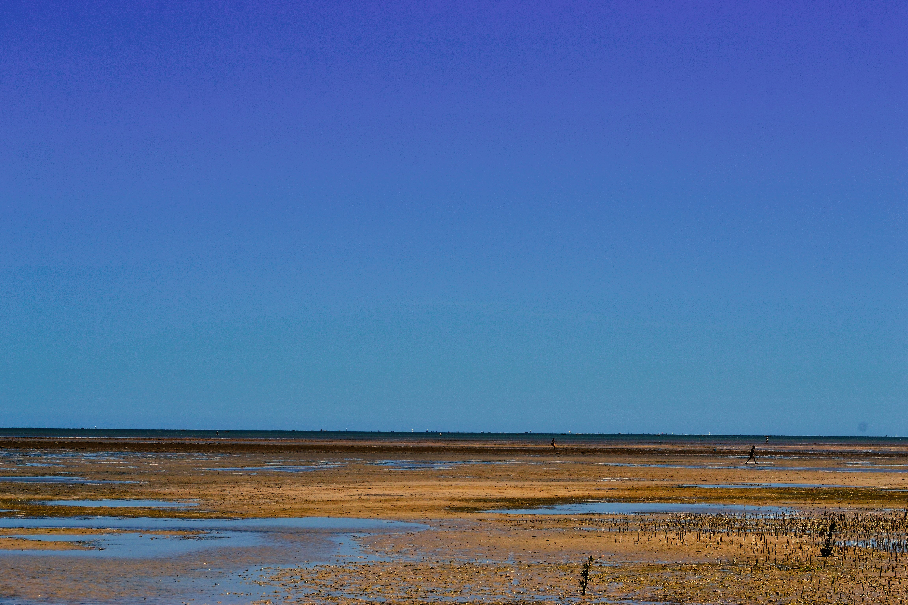
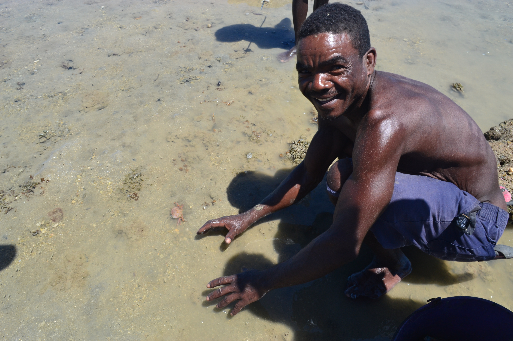
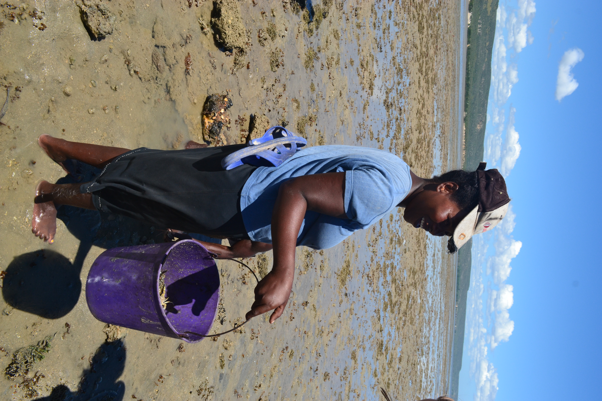
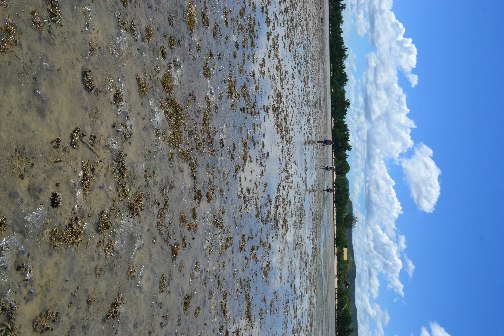

{fig-align="center" width="4in"}

{fig-align="center" width="4in"}

Villeneuve, Andrew R., Merrill Baker-Médard, Bemahafaly Randriamanantsoa, Olivia Fortunato-Jackson, and Easton R. White. 2026.“Asymmetric Thermal Risks Across Malagasy Macrotidal Reef ZonesThreaten Socioeconomic Outcomes for Local Fisheries.” *Cell Reports Sustainability*, September, 100825. <https://doi.org/10.1016/j.crsus.2026.100825>.

## The start of an idea: 2015, Grand Récif de Toliara

Imagine we are standing on the shore, looking out on this vista in southwestern Madagascar.

{fig-align="center"}

This is a reef flat, the part of a barrier reef adjacent to shore. In this part of Madagascar, the tidal range approaches three meters. As the tide has gone out, it has exposed close to two kilometer of seafloor directly out from the shore.

The sun is beating down from a cloudless sky on the landscape - the sails of dozens of pirogues hover miraculously above the horizon line as heat shimmers off the flats. We also see people walking this landscape, stopping and stooping next to pools of seawater let by the receding tide. In our view, we are seeing two main types of fishing - fishing by boat past the reef flats in the lagoon, and fishing by foot ('gleaning'). Seafood in southwestern Madagascar is a critical source of subsistence and livelihood for many communities, but the means of access and method are not the same. To own a pirogue is to expand options for fishing across the coast. But pirogues are costly and difficult to source, often available only to established, wealthier members of the community (and particularly men). Gleaning, however, requires very little gear - women, children, and less wealthy members of the community can easily access intertidal habitats like the reef flats and crests we are standing in [@abeare; @fröcklin2014; @pike2024; @cinner2010]. So, gleaning becomes an attractive method of obtaining food for the dinner table, as well as an opportunity for socialization [@grantham2020]. Gleaners target many different marine species, depending on time of year and end use, but can include crabs, small fish, octopus, sea cucumbers, and snails (for food and shell export).

::: {layout-nrow="2"}
{width="4in"} {width="4in"}
:::

During my first visit to Madagascar in 2015, I put my hand in the tide pools gleaners were fishing from, and was struck about how *hot* the water was. That sensation remained with me after I left, and over the next several years questions bubbled in the back of my mind...

*How hot does this intertidal environment get in the incessant Malagasy summer?*

*How can organisms survive this environment?*

*What is the implication of the poorest members of coastal communities fishing in these extreme environments*?

*Given all of this, what will happen to these organisms and this gleaning fishery as they climate warms?*

{width="4in"}

## Measuring reef temperatures, Salary Reef 2023

In 2023, as a PhD student at the University of New Hampshire, I had the opportunity to join a NSF-funded project investigating socio-ecological impacts of MPA design in Madagascar along with collaborators Mez Baker-Médard, Easton White, Bemahafaly Randrianamantsoa, and Ravelo Vololonavalona. I was interested in adding a climate change angle to the environmental justice focus of the grant. In consultation with our Malagasy collaborators, I deployed ten temperature loggers across the barrier reef at Salary village, located 100 km north of Toliara. Our team had been collecting fishery catch data on the same reef, and we wanted to pair these data with measurements of the physical environment the fishing was occurring in. We were able to recover five of those loggers a year later, and the data we recovered form the basis of the story for our new paper. Like any good science, the most interesting result was one we had not anticipated.

First, **shallower reef habitats (the ones where gleaning occurs) are warmer than deeper ones (where boat based fisheries occur).** While perhaps intuitive due to the enhanced role of atmospheric temperatures and water residence time on water temperatures, this result becomes interesting in the context of the duration of extreme conditions. While mean temperatures were similar, deeper reef sites spent 26% less time above 30°C, important in the context of exponential accumulation of organismal heat stress [@villeneuve2025].

Turning our attention to the truly intertidal site, we were surprised to see that **the hottest conditions do not occur in the austral summer (December-February). Instead, they occur during shoulder seasons (March-April and September-October).** This is because the most extreme annual tides occur not during the summer, but during these shoulder seasons. In fact, during the summer, relatively low tidal ranges buffer these intertidal reef flat habitats from extreme atmospheric temperatures and soalr radiation. Interestingly, the tidal harmonics in southwestern Madagascar are relatively stationary during the day, meaning the lowest low tides routinely occur around solar noon (and in the middle of the night). This means there is an alignment of extreme low tides with the hottest part of the day. **In short, intertidal organisms experience extreme temperature conditions twice a year, but when we would expect based on just air or water temperatures.** Further, because data observations occured during a weak point of the 18.6 yr cycle in tides, the temperature we observed were more benign than they will be in 2033, when the largest tide cycles will be observed.

Finally, our fishery catch data indicated the importance of reef flat habitats for local fisheries. While the number of fishing trips and total catch were relatively low in this zone, **each trip yielded a high catch per unit effort, indicating reef flats are productive habitats.** Considering gleaners rely on reef flats (and to a lesser extent, reef crests) to provide seafood, the productivity of this habitat is notable.

Our results are notable in that they provide crucial temporal and spatial context to how Malagasy fisheries may experience climate stress in the future. **We posit extreme intertidal temperatures may arise in the future due to an alignment of ocean temperatures, atmospheric conditions, and tidal cycles which will result in mortality and population reductions of organisms in the reef flat habitat.** Given socieconomically marginalized fishers tend to glean in these habitats, there is a real risk that the poorest fishers will experience climate-induced reductions in catch before boat-based fishers experience similar impacts. This highlights the importance of management interventions that account for the tenuousness of marginalized fishers in a warmer climate.

Further, heat-stress in gleaned organisms may not occur during the austral summer, when water temperatures are the highest, but immediately before and after, when tides are at their most extreme. Interventions aimed at either fished species or gleaner livelihoods may need to account for this seasonal assymetry.

## Looking Forward

Reefs like Salary or the Grand Récif de Toliara are data-poor. We lack a lot of fundamental data on the physical environment and the climate resilience of fished species that live there, and we historically we have not linked these well with social science and traditional ecological knowledge. In our paper, we suggest synergies between the environment, organism physiology, and socioeconomic structures in coastal communities may accelerate climate impacts in unexpected ways. Many additional future research angles present themselves: do sea cucumber and macroalgae farms in the region also experience similar thermal extremes? What are the thermal limits of intertidal fished organisms? How concerned should we be about the effects of extreme heat compared to unsustainable fishing practices, sedimentation, urbanization, and land use change?

All told, it has been exciting to see observations I made eleven years ago come full circle with the publication of this paper!
