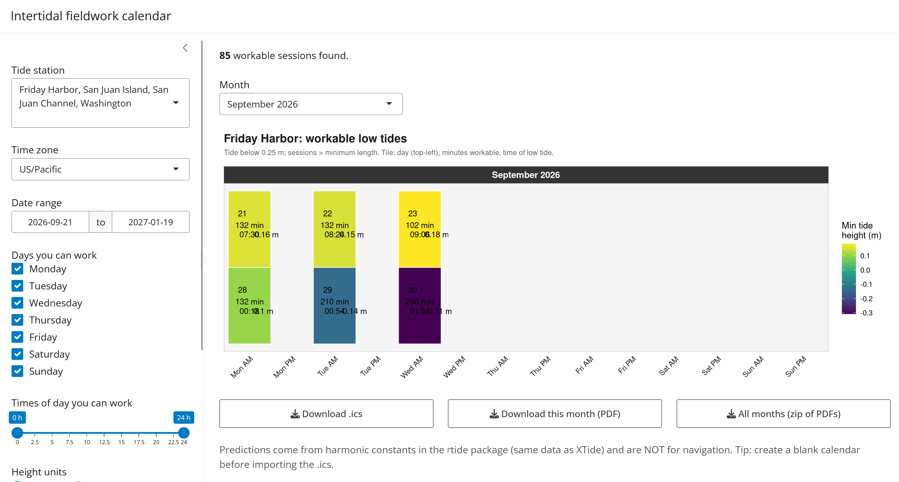

# Tide App

::: app-preview
[{fig-alt="Screenshot of the Intertidal Fieldwork Calendar Shiny app"}](https://01a0c633-84db-74c3-25ac-3c08d83ba41c.share.connect.posit.cloud/)

[Open the Tide Calendar app](https://01a0c633-84db-74c3-25ac-3c08d83ba41c.share.connect.posit.cloud/){.btn .btn-primary .btn-lg target="_blank" rel="noopener"}
:::

Inspired by a blog post ([When is it time to do intertidal fieldwork?](https://villesci.github.io/posts/2025-02-20-tide-calendar/)), I created a Shiny app that you, too, can use to create either calendar PDFs or an .ics calendar file of preferred field work days! More details are available on the blog post, but below is an example of the PDF calendar you can create based on:

- NOAA tide station (via `rtide`)

- Dates of interest

- Days of week you wish to conduct fieldwork

- Hours of day you wish to conduct fieldwork

- Minimum tide height at which you wish to conduct fieldwork

- Minimum time below the minimum tide height you wish to allow for a field work session (to avoid the 1 minute below your desired tide height!)

{width="100%" height="600px"}
